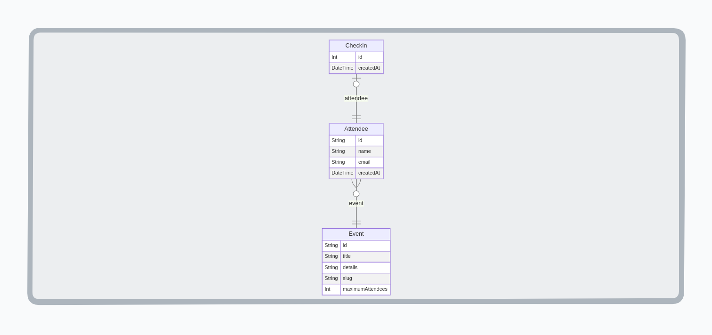

<a name="passin_nlw_unite"></a>

[![Contributors][contributors-shield]][contributors-url]
[![Forks][forks-shield]][forks-url]
[![Stargazers][stars-shield]][stars-url]
[![Issues][issues-shield]][issues-url]
[![nlw][nlw-shield]][nlw-url]
[![LinkedIn][linkedin-shield]][linkedin-url]


<!-- PROJECT LOGO -->
<br />
<div align="center">

  <h3 align="center">Check in</h3>

  <p align="center">
    BackEnd project application built in Java and Spring Boot during the NLW 15 by Rocktseat.
    <br />
    <a href="https://github.com/luk3mn/passin_nlw_unite/README.md"><strong>Explore the docs »</strong></a>
    <br />
    <br />
  </p>
</div>


<!-- TABLE OF CONTENTS -->
<details>
  <summary>Table of Contents</summary>
  <ol>
    <li>
      <a href="#about-the-project">About The Project</a>
      <ul>
        <li><a href="#built-with">Built With</a></li>
      </ul>
    </li>
    <li>
      <a href="#getting-started">Getting Started</a>
      <ul>
        <li><a href="#prerequisites">Prerequisites</a></li>
        <li><a href="#installation">Installation</a></li>
      </ul>
    </li>
    <li><a href="#usage">Usage</a></li>
    <!-- <li><a href="#deploy">Deploy</a></li> -->
    <li><a href="#roadmap">Roadmap</a></li>
    <li><a href="#license">License</a></li>
    <li><a href="#authors">Authors</a></li>
    <li><a href="#feedback">Feedback</a></li>
    <li><a href="#acknowledgments">Acknowledgments</a></li>
  </ol>
</details>


<!-- ABOUT THE PROJECT -->
## About The Project
<!--  -->


<p align="justify">
  In this project, we were able to find subjects like, such as: 

  - **ORM;** 
  - **JPA;** 
  - **Rest API;**
</p> 

<p align="right">(<a href="#passin_nlw_unite">back to top</a>)</p>


### Built With

Write here

* [![Java][Java]][Java-url]
* [![Spring][Spring]][Spring-url]
<!-- * [![PostgreSQL][PostgreSQL]][PostgreSQL-url] -->

<p align="right">(<a href="#passin_nlw_unite">back to top</a>)</p>


<!-- GETTING STARTED -->
## Getting Started

Here are some important topics about this project and how to replay it.

### Prerequisites

  Clone the repo
   ```sh
   git clone https://github.com/luk3mn/passin_nlw_unite.git
   ```

### Installation

_Before starting this application in your local environment, it'll be necessary to proceed with some tasks to reproduce this project._

1. Java 17
2. Maven
<!-- 2. Install packages
   ```sh
   
   ``` -->

<p align="right">(<a href="#passin_nlw_unite">back to top</a>)</p>


<!-- USAGE EXAMPLES -->
## Usage


<!-- Deploy -->
<!-- ## Deploy -->


<!-- ROADMAP -->
## Roadmap

- [x] Init project
- [x] Creating and configuring database
- [x] Creating database migrations
- [x] Creating entities to represent the data
- [x] Creating an **EventService**
- [x] Creating an **AttendeeService**
- [x] Creating POST and GET endpoint to Event and Attendee
  - [x] GET /events/{eventId}/attendees
  - [x] GET /events/{eventId}
  - [x] POST /events
- [x] Exceptions handling
- [x] Adding new features to AttendeeService
- [ ] adding new endpoints
  - [x] POST /events/{eventId}/attendees
  - [x] GET /attendees/{attendeeId}/badge
  - [ ] POST /attendees/{attendeeId}/check-in
- [ ] CheckInService


<p align="right">(<a href="#passin_nlw_unite">back to top</a>)</p>


<!-- LICENSE -->
## License

Distributed under the MIT License. See `LICENSE.txt` for more information.

<p align="right">(<a href="#passin_nlw_unite">back to top</a>)</p>


## Authors

- username: [@luk3mn](https://www.github.com/luk3mn)

## Feedback

If you have any feedback, please reach out to us at lucasnunes2030@gmail.com

> Project Link: [https://github.com/luk3mn/passin_nlw_unite](https://github.com/luk3mn/passin_nlw_unite)

<p align="right">(<a href="#passin_nlw_unite">back to top</a>)</p>


<!-- ACKNOWLEDGMENTS -->
## Acknowledgments

* [Rocketseat](https://www.rocketseat.com.br/)


<p align="right">(<a href="#passin_nlw_unite">back to top</a>)</p>


<!-- MARKDOWN LINKS & IMAGES -->
<!-- https://www.markdownguide.org/basic-syntax/#reference-style-links -->
[contributors-shield]: https://img.shields.io/github/contributors/luk3mn/passin_nlw_unite.svg?style=for-the-badge
[contributors-url]: https://github.com/luk3mn/passin_nlw_unite/graphs/contributors
[issues-shield]: https://img.shields.io/github/issues/luk3mn/passin_nlw_unite.svg?style=for-the-badge
[issues-url]: https://github.com/luk3mn/passin_nlw_unite/issues
[forks-shield]: https://img.shields.io/github/forks/luk3mn/passin_nlw_unite.svg?style=for-the-badge
[forks-url]: https://github.com/luk3mn/passin_nlw_unite/network/members
[stars-shield]: https://img.shields.io/github/stars/luk3mn/passin_nlw_unite.svg?style=for-the-badge
[stars-url]: https://github.com/luk3mn/passin_nlw_unite/stargazers
[license-shield]: https://img.shields.io/github/license/othneildrew/Best-README-Template.svg?style=for-the-badge
[license-url]: https://github.com/luk3mn/passin_nlw_unite/blob/master/LICENSE
[linkedin-shield]: https://img.shields.io/badge/-LinkedIn-black.svg?style=for-the-badge&logo=linkedin&colorB=555
[linkedin-url]: https://www.linkedin.com/in/lucasmaues/
[nlw-shield]: https://img.shields.io/static/v1?label=NLW&message=15&color=8257E5&style=for-the-badge&colorB=555
[nlw-url]: https://www.rocketseat.com.br/

<!-- Stack Shields -->
<!-- Stack Shields -->
[Java]: https://img.shields.io/badge/Java-E02027?style=for-the-badge&logo=java&logoColor=ffffff
[Java-url]: https://www.java.com/en/
[Spring]: https://img.shields.io/badge/SrpingBoot-6DB33F?style=for-the-badge&logo=springboot&logoColor=ffffff
[Spring-url]: https://spring.io/projects/spring-boot